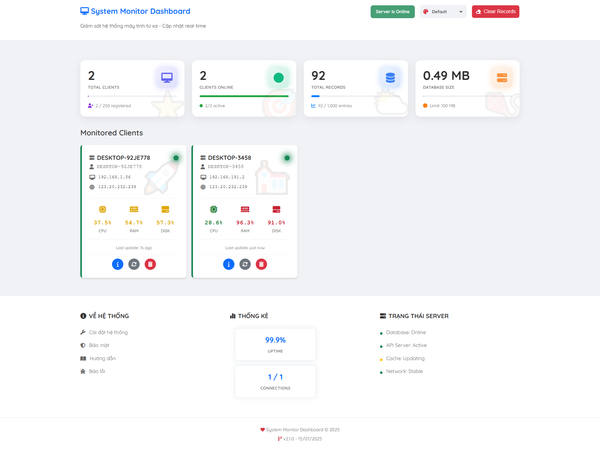
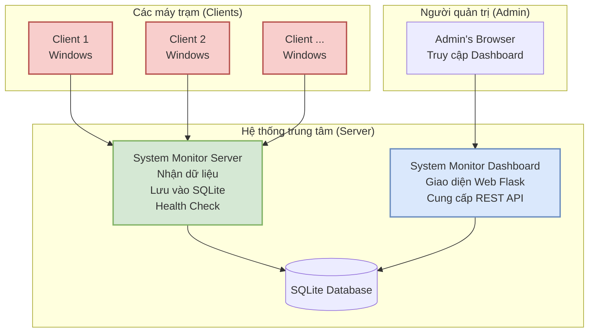

# System Monitor

<p align="center">
  
  
  
  
</p>

<p align="center">
  <b><i>Giải pháp giám sát hệ thống Windows từ xa, tập trung, và trực quan theo thời gian thực.</i></b>
</p>

<p align="center">
  <!-- Thêm ảnh chụp màn hình dashboard ở đây để tăng tính trực quan -->

</p>

---

**System Monitor** là một hệ thống mạnh mẽ cho phép quản trị viên thu thập, lưu trữ và hiển thị thông tin chi tiết về phần cứng, phần mềm, hiệu năng và các sự kiện bảo mật từ nhiều máy tính Windows một cách tập trung và realtime.

## 📜 Mục lục

- [✨ Tính năng nổi bật](#-tính-năng-nổi-bật)
- [🏗️ Sơ đồ kiến trúc](#️-sơ-đồ-kiến-trúc)
- [🧩 Thành phần hệ thống](#-thành-phần-hệ-thống)
- [🖥️ Yêu cầu hệ thống](#️-yêu-cầu-hệ-thống)
- [🚀 Cài đặt và Vận hành](#-cài-đặt-và-vận-hành)
  - [1. Cài đặt trên máy chủ (Server)](#1-cài-đặt-trên-máy-chủ-server)
  - [2. Cài đặt trên máy trạm (Client)](#2-cài-đặt-trên-máy-trạm-client)
- [⚙️ Cấu hình](#️-cấu-hình)
- [🤝 Đóng góp](#-đóng-góp)
- [✍️ Tác giả](#️-tác-giả)
- [📄 Giấy phép](#-giấy-phép)

---

## ✨ Tính năng nổi bật

-   **🖥️ Thu thập thông tin phần cứng:** CPU, RAM, Disk, GPU, Mainboard, Network Adapters, Printers, thông tin hệ điều hành (OS) và định danh hệ thống (System ID).
-   **📊 Theo dõi hiệu năng Realtime:** Giám sát tải CPU, mức sử dụng RAM, hoạt động của Disk (I/O), và lưu lượng mạng (Gửi/Nhận).
-   **🛡️ Giám sát bảo mật và hoạt động:**
    -   Theo dõi sự kiện hệ thống (Windows Event Log).
    -   Liệt kê tài khoản người dùng (User Accounts) và thông tin đăng nhập (Credentials).
    -   Giám sát Dịch vụ (Services) và các ứng dụng khởi động cùng hệ thống (Startup Programs).
    -   Liệt kê phần mềm đã cài đặt và các tiến trình đang chạy (Processes).
    -   Truy xuất lịch sử duyệt web (Web History).
-   **🌐 Giao diện Dashboard trực quan:**
    -   Dashboard nền web (Flask) dễ truy cập, quản lý tập trung.
    -   Hiển thị trạng thái (online/offline) của tất cả các client.
    -   Cung cấp nhiều tab chi tiết cho từng client, cập nhật dữ liệu realtime.
-   **⚙️ Linh hoạt và tin cậy:**
    -   Cơ chế Health Check server.
    -   Cấu hình linh hoạt thông qua file `config.ini`.
    -   Tự động kết nối lại khi client mất kết nối với server.
    -   Đóng gói thành file `.exe` độc lập, dễ dàng triển khai.

## 🏗️ Sơ đồ kiến trúc

Hệ thống hoạt động theo mô hình Client-Server với một Dashboard giao diện web để hiển thị dữ liệu.



## 🧩 Thành phần hệ thống

1.  **Server**: Lõi trung tâm, lắng nghe kết nối WebSocket từ client, xử lý và lưu dữ liệu vào cơ sở dữ liệu SQLite.
2.  **Client**: Một agent chạy ẩn trên các máy Windows cần giám sát, chịu trách nhiệm thu thập và gửi dữ liệu định kỳ về server.
3.  **Dashboard**: Giao diện web được xây dựng bằng Flask, cung cấp một cổng thông tin trực quan để quản trị viên xem, phân tích và giám sát trạng thái của tất cả client.

## 🖥️ Yêu cầu hệ thống

-   **Hệ điều hành:** Windows 10, Windows 11.
-   **Lưu ý:** Có thể hoạt động trên Windows 7/8 nhưng chưa được kiểm thử đầy đủ.
-   **Mạng:** Cần kết nối mạng giữa Client và Server (LAN/WAN).

---

## 🚀 Cài đặt và Vận hành

### 1. Cài đặt trên máy chủ (Server)

Đây là máy trung tâm để nhận dữ liệu và host giao diện web.

**📁 Cấu trúc thư mục yêu cầu:**

```
SERVER_MACHINE/
├── System Monitor Server.exe
├── System Monitor Dashboard.exe
├── config.ini
├── templates/
│   └── (các file html của dashboard)
└── static/
    └── (các file css, js, images)
```

**▶️ Các bước thực hiện:**

1.  **Chạy Server:** Mở file `System Monitor Server.exe`. Một cửa sổ console sẽ hiện ra để bạn theo dõi log kết nối và dữ liệu nhận được từ client.
2.  **Chạy Dashboard:** Chạy file `System Monitor Dashboard.exe`. File này sẽ chạy ở chế độ nền (không có giao diện).
3.  **Truy cập Dashboard:** Mở trình duyệt web và truy cập vào địa chỉ `http://<IP_CUA_MAY_CHU>:5000`.

> ⚠️ **Quan trọng:** Đảm bảo Firewall trên máy chủ đã mở port `8765` (cho Server) và `5000` (cho Dashboard).

### 2. Cài đặt trên máy trạm (Client)

Đây là các máy cần được giám sát.

**📁 Cấu trúc thư mục yêu cầu:**

```
CLIENT_MACHINE/
├── System Monitor Client.exe
└── config.ini
```

**▶️ Các bước thực hiện:**

1.  **Cấu hình:** Mở file `config.ini` và chỉnh sửa các thông số cho phù hợp.
2.  **Chạy Client:** Chạy file `System Monitor Client.exe`. Chương trình sẽ chạy ẩn và tự động gửi dữ liệu về server đã được cấu hình.

## ⚙️ Cấu hình

Toàn bộ cấu hình của hệ thống được quản lý trong file `config.ini`.

**Ví dụ file `config.ini` trên máy Client:**

```ini
[client]
; IP hoặc hostname của máy chủ System Monitor Server
server = 192.168.1.100

; Port của WebSocket server (phải khớp với server)
port = 8765

; Thời gian (giây) thử kết nối lại nếu thất bại
retry_interval = 10

; Tần suất (giây) gửi dữ liệu hiệu năng (metrics)
refesh_interval = 5

; Tần suất (giây) gửi lại thông tin chi tiết hệ thống
update_info_interval = 3600
```

## 🤝 Đóng góp

Chúng tôi hoan nghênh mọi sự đóng góp để cải thiện dự án! Nếu bạn có ý tưởng hoặc muốn vá lỗi, vui lòng tạo một "Issue" hoặc "Pull Request".

## ✍️ Tác giả

-   **Cao Phước Danh** - *Phát triển chính*

Dự án có tham khảo và sử dụng các ý tưởng từ cộng đồng và sự hỗ trợ của công cụ AI.

## 📄 Giấy phép

Dự án này được cấp phép theo Giấy phép MIT. Xem file `LICENSE.md` để biết chi tiết.

---
<p align="center">
  <i>Hệ thống lý tưởng cho quản trị viên IT, phòng lab, trường học, và doanh nghiệp nhỏ.</i>
</p>
